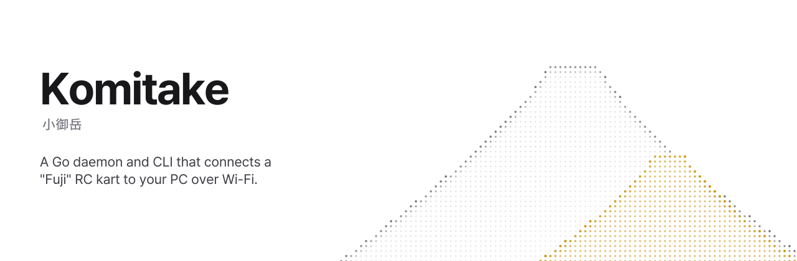

<p align="center">
  
</p>

<a href="https://ja.wikipedia.org/wiki/%E5%AF%8C%E5%A3%AB%E5%B1%B1#%E5%9C%B0%E8%B3%AA%E5%AD%A6%E4%B8%8A%E3%81%AE%E5%AF%8C%E5%A3%AB%E5%B1%B1">
  <code>Komitake</code> <sup>(小御岳)</sup>
</a> is a Go daemon and CLI that provides the Wi-Fi connectivity plane for a companion RC kart (Fuji).
It emulates the <code>"game"</code>'s <code>FujiControl</code> classes and several <code>LSP</code> and <code>MoLive2</code> demuxing into a one bundled daemon, allowing you to control and manage connection.  
<br />
<br />
  
> [!TIP]  
> **Looking for how to use kart on your PC?** [Click here](./QUICKSTART.md)

## What does it do?

- Brings up the LP2P access point the kart joins (patched [OpenKart `hostapd`](https://github.com/OpenKart-SDK/hostapd))
- Pairs the kart with a QR code (Fuji pairing / group info)
- Keeps the RCD link up and talks Fuji control
- Also keeps up the LSP link up and ingest live camera feed
- Drive, telemetry, and live camera from the PC
- Optional web UI (REST / WebSocket / WebRTC) and a Go client SDK with control/pair interface

Live camera formats are in [docs/fuji-video.md](docs/fuji-video.md). 

## Prerequisites

- Go 1.26+
- C toolchain, `pkg-config`, libnl-3 / libnl-genl-3 (patched `hostapd`)
- FFmpeg with VAAPI (`h264_vaapi`) for live camera
- `ffplay` for `komitake video`
- Node.js / npm from [NodeSource](https://github.com/nodesource/distributions) to rebuild the embedded web UI

Hostapd build deps (helper detects your package manager):

```sh
./scripts/deps.sh
```

Debian/Ubuntu by hand:

```sh
sudo apt install build-essential libnl-3-dev libnl-genl-3-dev pkg-config
```

## Build

Clone with nested submodules (OpenKart hostapd wraps upstream `hostap`):

```sh
git clone --recurse-submodules https://github.com/Alex4386/komitake
# or, in an existing checkout:
git submodule update --init --recursive
```

Then:

```sh
./build.sh                          # patched hostapd → ./hostapd
go generate ./internal/wireless/lp2p # OpenKart lp2p nonce table (network)
./scripts/rebuild-webui.sh          # optional; embeds UI under internal/web/frontend/dist
go build -o komitake ./cmd/komitake
```

`./build.sh` initializes `third_party/openkart-hostapd` and nested `hostap` if needed. `go generate` writes `internal/wireless/lp2p/lp2p_nonces.bin` (gitignored, embedded at compile time). Without a UI build, `komitake web` still serves the API and a placeholder page.

Edit banner copy in [docs/banner.svg](docs/banner.svg), then regenerate the path-based README asset (downloads [Pretendard JP](https://github.com/orioncactus/pretendard) into `docs/fonts/` on first run):

```sh
./scripts/expand-banner.sh   # writes docs/banner.expanded.svg
```

## Install

```sh
./INSTALL
```

Defaults:

| Artifact | Path |
| --- | --- |
| CLI / daemon | `/usr/bin/komitake` |
| Patched hostapd | `/usr/bin/komitake-hostapd` |
| Config | `/etc/komitake/` |
| systemd unit | `/etc/systemd/system/komitake.service` |

The unit text is generated by [scripts/install-systemd.sh](scripts/install-systemd.sh) (no separate `.service` file to keep in sync):

```sh
sudo ./scripts/install-systemd.sh
sudo systemctl enable --now komitake.service
```

## Usage

```sh
komitake daemon        # run the daemon (foreground)
komitake set           # change settings (e.g. --wireless-interface=wlan0)
komitake pair          # pairing QR in the terminal
komitake status        # mode, wireless, pairing state
komitake devices       # connected karts (serial / kind; -l for detail)
komitake video         # live camera via ffplay
komitake web           # REST + drive/telemetry/video UI
```

Clients talk to the daemon over the admin API (`unix:/run/komitake.sock` by default, or TCP via `--address` / `socket.bind`).  
See [USAGE.md](./USAGE.md) for pairing, the web UI and REST API, video, config, logging, and shell completion.  
For Quickstart, see [QUICKSTART.md](./QUICKSTART.md) for how to get it running in no time.

## Notes

- LP2P AP mode needs the patched `hostapd` from `third_party/openkart-hostapd`; `./build.sh` builds it by default.
- Install rewrites `wireless.hostapd_path` to the installed `komitake-hostapd`.
- Local `./config.json` wins over `/etc/komitake/config.json` unless `--config` is set. See [config.example.json](./config.example.json).
- Config uses nested `socket`, `web`, and `wireless` objects; legacy flat keys still load and are migrated on save.
- Video transcode uses hardware H.264 when available. Set `video.hwaccel` to `auto` (default), `vaapi`, `nvenc`, `qsv`, or `custom` in config.json. `auto` probes ffmpeg encoders and `/dev/dri/renderD*` at daemon startup. Optionally set `video.ffmpeg_path` and `video.ffmpeg_args` to override the binary or append custom input/output arguments. There is no silent software fallback unless you configure it explicitly.
- If you are using `NetworkManager` or other NIC management daemons, this "might" conflict with that, disable NetworkManager on the specified interface with following command:
  ```bash
  sudo nmcli device set <iface> managed no
  ```

## Architecture

```
cmd/komitake/                 # cobra CLI
internal/wireless/            # hostapd AP, DHCP, LP2P
internal/wireless/lp2p/       # vendor-IE crypto + generated nonce table
internal/rcd/                 # RCD wire protocol + handshake
internal/fuji/                # pairing, control, drive, telemetry
internal/daemon/              # DOWN / PAIRING / RUNNING; LSP video + transcoder
internal/config/              # config + persistent pairing/state
internal/ipc/                 # AdminService adapters (no protobuf in the SM)
internal/web/                 # huma REST, WS, WebRTC, embedded Vite/React UI
internal/logging/             # slog + secret redaction
pkg/komitake/                 # public Go client for the admin API
proto/komitake/admin/v1/      # AdminService schema + generated stubs
docs/                         # Fuji LSP / video format notes
```

Admin RPCs are defined in [proto/komitake/admin/v1/admin.proto](proto/komitake/admin/v1/admin.proto). Generated `*.pb.go` files are committed. Plugins are pinned as `tool` directives in `go.mod`:

```sh
go install github.com/bufbuild/buf/cmd/buf@latest
buf generate proto
```

State changes and connect/disconnect funnel through `daemon.Observer` ([internal/daemon/events.go](internal/daemon/events.go)); the default is a no-op.

## Implementation Guide

Wire formats follow the [switchbrew documentation](https://switchbrew.org/wiki/Mario_Kart_Live:_Home_Circuit). Fuji LSP video layouts used by Komitake are summarized in [docs/fuji-video.md](docs/fuji-video.md).

## Credits

- [switchbrew.org documentation](https://switchbrew.org/wiki/Mario_Kart_Live:_Home_Circuit)
- [openkart sdk](https://github.com/openkart-sdk/openkart)

## FAQ

- **Why name it [Komitake](https://ja.wikipedia.org/wiki/%E5%AF%8C%E5%A3%AB%E5%B1%B1#%E5%9C%B0%E8%B3%AA%E5%AD%A6%E4%B8%8A%E3%81%AE%E5%AF%8C%E5%A3%AB%E5%B1%B1)?**  
  IRL, Mt. Fuji is built on top of Mt. Komitake. <sup><a href="https://ja.wikipedia.org/wiki/%E5%AF%8C%E5%A3%AB%E5%B1%B1#%E5%9C%B0%E8%B3%AA%E5%AD%A6%E4%B8%8A%E3%81%AE%E5%AF%8C%E5%A3%AB%E5%B1%B1">Wiki (Japanese)</a></sup>  
  Your Fuji control stack runs on Komitake the same way.

- **What do I need?**  
  A Linux PC, a Wi-Fi adapter that supports SoftAP mode, and a Fuji kart. See [QUICKSTART.md](./QUICKSTART.md) for a step-by-step setup.

- **Does it run on macOS or Windows?**  
  The daemon (access point, pairing, drive, camera transcode) is Linux-only today because it drives a patched `hostapd` and configures the wireless interface directly. You can run client commands (`komitake status`, `komitake web`, …) from another OS by pointing `--address` at a Linux host with `socket.bind` set to TCP.  
  You can technically try with WSL2, but it is not supported. continue at your own risk. [./docs/wsl2-setup.md](./docs/wsl2-setup.md)
